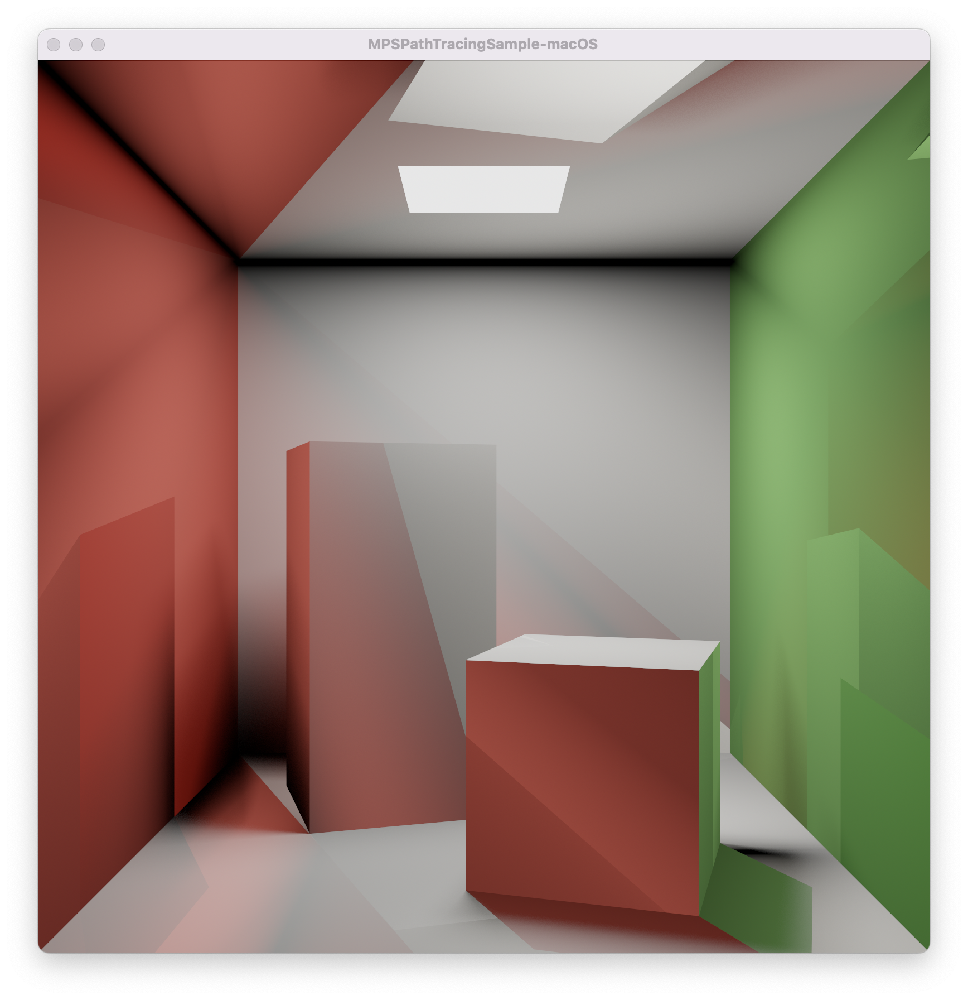
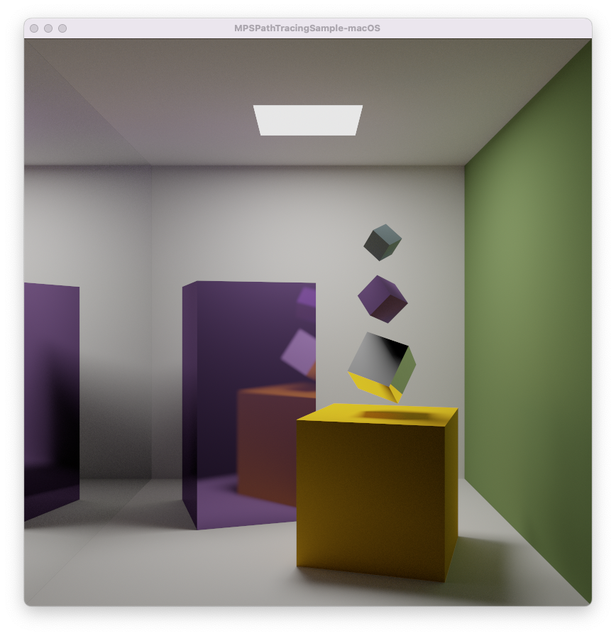
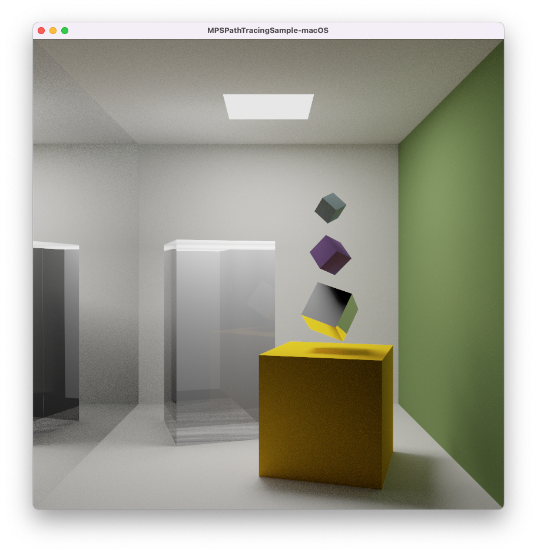
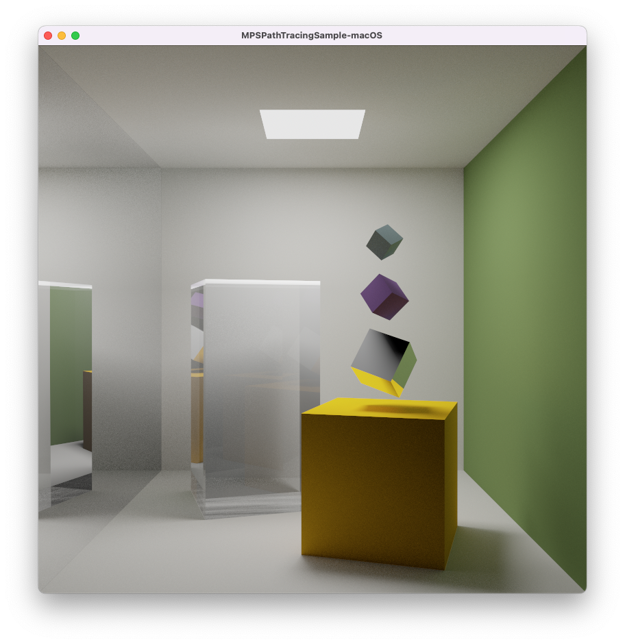

# Build Systems Training Project
# Metal GPU Ray Tracing
>by Giorge Koulin (Digital Design)

---

# Project Goals
Based on [Apple's "Metal For Accelerating Ray Tracing"](https://developer.apple.com/documentation/metalperformanceshaders/metal_for_accelerating_ray_tracin) example.
1. Add support for CMake build system.
2. Add new language support for Metal shaders in CMake.
3. Once the project builds with CMake/Conan, add some fun features like custom materials.


---

# 1. Add support for CMake build system.

We all know how to do that :stuck_out_tongue_winking_eye:.

If you can't remember, go back and review "Build Systems Training" course notes :mortar_board:.

---

# 2. Add a New CMake Metal Language

How to do this is outlined in [CMakeAddNewLanguage.txt](https://github.com/Kitware/CMake/blob/master/Modules/CMakeAddNewLanguage.txt)

Summary
- `CMakeDetermine(LANG)Compiler.cmake` - find the compiler and configure it.
- `CMake(LANG)Compiler.cmake.in` - input file for compiler configuration, try compiles do not need to re-determine and test.
- `CMakeTest(LANG)Compiler.cmake` - test the compiler works.
- `CMake(LANG)Information.cmake` - set up rule variables, e.g. how to create object, library, executable.
- `CMAKE_MODULE_PATH` - append the directory.

---

# 2. Add a New CMake Metal Language

Enable the new language:
```cmake
# Enable custom Metal language support
list(APPEND CMAKE_MODULE_PATH "${CMAKE_CURRENT_SOURCE_DIR}/cmake/metal")
enable_language(Metal)
```

Add a new library:
```cmake
# Add default Metal shaders lib
add_library(shaderLib SHARED shader.metal)
```

---

# 3. Add Custom Material

### Lambertian diffuse broken random numbers :cry:



---

# 3. Add Custom Material

### Lambertian diffuse fixed :raised_hands:


---

# 3. Add Custom Material

### Metallic



---

# 3. Add Custom Material

### Glass broken :cry:



---

# 3. Add Custom Material

### Glass fixed :raised_hands:



---

# 3. Add Custom Material

### All glass :heart_eyes:


---

# Thanks, Questions?

Feel free to play with the [repo](https://github.com/gkoulin/metal-ray-tracing).


